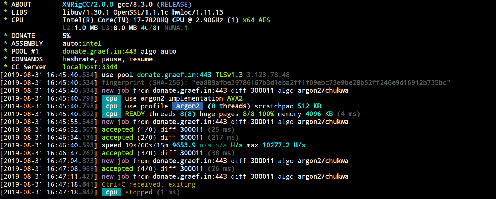
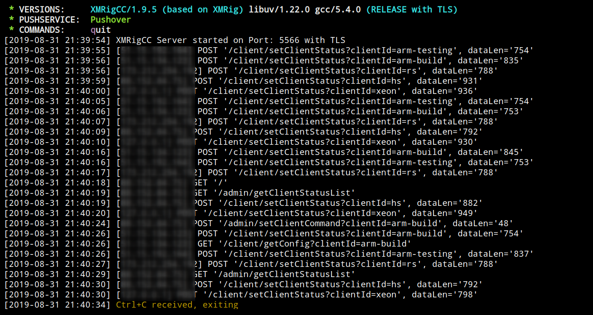
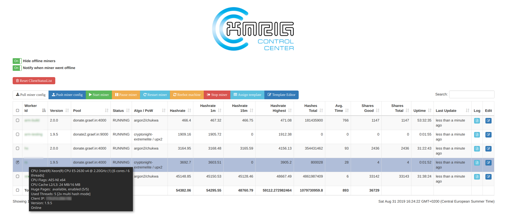

WAZNRig
======================

WAZNRig is a high performance WAZN1, RandomX, CryptoNight and Argon2 CPU miner supporting Win10 and Ubuntu OS flavors.

[](https://opensource.org/licenses/GPL-3.0)

**This is CPU variant of WAZNRig. If you're looking for the AMD GPU (OpenCL) version redirect to: [waznrig-amd](https://github.com/project-wazn/waznrig-amd/).**

### About WAZNRig

WAZNRig is a [XMRigCC](https://github.com/Bendr0id/xmrigCC) fork adding remote control and monitoring functions to WAZNRig instances via a Webfrontend and REST api. It has built in "Command and Control" (C&amp;C) server part, a daemon keeping waznrigMiner alive and sending its current status to C&amp;C Server.

The modified version can handle commands as "update config", "start/stop mining" or "restart/shutdown/reboot" and they can be sent from the C&amp;C Dashboard.

Assign config templates to multiple miners with a single click and let them switch configs without connecting to any of them. Watch your miners logs with simple remote log viewer and monitor you miners. When the hash rate drops or one of your miners goes offline you can opt-in notification system provided by PushOver or Telegram and status changes will be sent to you automatically.

## Additional features of WAZNRig

Check the [Coin Configuration](https://github.com/Bendr0id/xmrigCC/wiki/Coin-configurations) guide

* **Support of WAZN1 variant (algo: "cn-wazn1")**
* **Support of RandomxARQ variant (algo: "rx/arq")**
* **Support of CN-Conceal variant (algo: "cn/conceal")**
* **Better performance for ARMv8 CPUs**
* Full SSL/TLS support
* NUMA support
* Command and control server
* CC Dashboard with:
    * statistics of all connected miners
    * remote control miners (start/stop/restart/shutdown)
    * remote configuration changes of miners
    * simple config editor for miner / config templates
    * monitoring / offline notification push notifications via Pushover and Telegram
* Daemon to restart the miner

**WAZNRig Daemon**



**WAZNRig Server**



**WAZNRig Dashboard**



## Download
* Binary releases: https://github.com/project-wazn/waznrig/releases
* Git tree: https://github.com/project-wazn/waznrig.git

## Usage
### Basic example waznrigServer
```
waznrigServer --port=3344 --user=admin --pass=pass --access-token=SECRET_TOKEN_TO_ACCESS_CC_SERVER
```

### Options waznrigServer
```
  -b, --bind arg                The CC Server bind ip (default: 0.0.0.0)
  -p, --port N                  The CC Server port
  -U, --user arg                The CC Server admin user
  -P, --pass arg                The CC Server admin pass
  -T, --token arg               The CC Server access token for the CC Client
  -t, --tls                     Enable SSL/TLS support
  -K, --key-file FILE           The private key file to use when TLS is ON
                                (default: server.key)
  -C, --cert-file FILE          The cert file to use when TLS is ON (default:
                                server.pem)
  -B, --background              Run the Server in the background
  -S, --syslog                  Log to the syslog
      --no-colors               Disable colored output
      --pushover-user-key arg   The user key for pushover notifications
      --pushover-api-token arg  The api token/keytoken of the application for
                                pushover notification
      --telegram-bot-token arg  The bot token for telegram notifications
      --telegram-chat-id arg    The chat-id for telegram notifications
      --push-miner-offline-info
                                Push notification for offline miners and
                                recovery (default: true)
      --push-miner-zero-hash-info
                                Push notification when miner reports 0
                                hashrate and recovers (default: true)
      --push-periodic-mining-status
                                Push every hour a status notification
                                (default: true)
      --custom-dashboard FILE   The custom dashboard to use (default:
                                index.html)
      --client-config-folder FOLDER
                                The CC Server access token for the CC Client
      --log-file FILE           The log file to write
      --client-log-lines-history N
                                Maximum lines of log history kept per miner
                                (default: 100)
  -c, --config FILE             The JSON-format configuration file to use
  -h, --help                    Print this help
```


### Basic example waznrigDaemon
```
waznrigDaemon -o pool.wazn.io:5555 -u YOUR_WAZN_WALLET -p x -k --cc-url=IP_OF_CC_SERVER:PORT --cc-access-token=SECRET_TOKEN_TO_ACCESS_CC_SERVER --cc-worker-id=OPTIONAL_WORKER_NAME
```

### Options waznrigDaemon
```
  -a, --algo=ALGO                   specify the algorithm to use
                                      cn/r, cn/2, cn/1, cn/0, cn/double, cn/half, cn/fast,
                                      cn/rwz, cn/zls, cn/xao, cn/rto, cn/conceal,
                                      cn-lite/1,
                                      cn-heavy/xhv, cn-heavy/tube, cn-heavy/0,
                                      cn-pico
                                      cn-wazn1, cn-extremelite
                                      argon2/chukwa, argon2/wrkz
                                      rx/wow, rx/loki, rx/arq
      --coin=COIN                   specify coin instead of algorithm                                      
  -o, --url=URL                     URL of mining server
  -O, --userpass=U:P                username:password pair for mining server
  -u, --user=USERNAME               username for mining server
  -p, --pass=PASSWORD               password for mining server
      --rig-id=ID                   rig identifier for pool-side statistics (needs pool support)
  -t, --threads=N                   number of miner threads
  -v, --av=N                        algorithm variation, 0 auto select
  -k, --keepalive                   send keepalived packet for prevent timeout (needs pool support)
      --nicehash                    enable nicehash.com support
      --tls                         enable SSL/TLS support (needs pool support)
      --tls-fingerprint=F           pool TLS certificate fingerprint, if set enable strict certificate pinning
      --daemon                      use daemon RPC instead of pool for solo mining
      --daemon-poll-interval=N      daemon poll interval in milliseconds (default: 1000)
  -r, --retries=N                   number of times to retry before switch to backup server (default: 5)
  -R, --retry-pause=N               time to pause between retries (default: 5)
      --cpu-affinity                set process affinity to CPU core(s), mask 0x3 for cores 0 and 1
      --cpu-priority                set process priority (0 idle, 2 normal to 5 highest)
      --no-huge-pages               disable huge pages support
      --no-color                    disable colored output
      --donate-level=N              donate level, default 5% (5 minutes in 100 minutes)
      --user-agent                  set custom user-agent string for pool
  -B, --background                  run the miner in the background
  -c, --config=FILE                 load a JSON-format configuration file
  -l, --log-file=FILE               log all output to a file
  -S, --syslog                      use system log for output messages
      --asm=ASM                     ASM optimizations, possible values: auto, none, intel, ryzen, bulldozer.
      --print-time=N                print hashrate report every N seconds
      --api-worker-id=ID            custom worker-id for API
      --api-id=ID                   custom instance ID for API
      --http-enabled                enable HTTP API
      --http-host=HOST              bind host for HTTP API (default: 127.0.0.1)
      --http-port=N                 bind port for HTTP API
      --http-access-token=T         access token for HTTP API
      --http-no-restricted          enable full remote access to HTTP API (only if access token set)
      --randomx-init=N              threads count to initialize RandomX dataset
      --randomx-no-numa             disable NUMA support for RandomX
      --export-topology             export hwloc topology to a XML file and exit
      --cc-disabled                 disable CC Client feature
      --cc-url=URL                  url of the CC Server
      --cc-access-token=T           access token for CC Server
      --cc-worker-id=ID             custom worker-id for CC Server
      --cc-update-interval-s=N      status update interval in seconds (default: 10 min: 1)
      --cc-use-tls                  enable tls encryption for CC communication
      --cc-use-remote-logging       enable remote logging on CC Server
      --cc-upload-config-on-start   upload current miner config to CC Server on startup
      --cc-reboot-cmd=CMD           command/bat to execute to Reboot miner machine
      --dry-run                     test configuration and exit
  -h, --help                        display this help and exit
  -V, --version                     output version information and exit
```


## Common Issues
### waznrigMiner
* waznrigMiner is just the worker, it is not designed to work standalone. Please start **waznrigDaemon** instead.

### Windows only: DLL error on starting
* Make sure that you installed latest Visual C++ Redistributable for Visual Studio 2015. Can be downloaded here: [microsoft.com](https://www.microsoft.com/de-de/download/details.aspx?id=48145)

### Linux only: Background mode
* The `--background` option will only work properly for the waznrigServer. But there is a simple workaround for the waznrigDaemon process. Just append an `&` to the command and it will run smoothly in the background.

    `./waznrigDaemon --config=my_config_cc.json &` or you just use `screen`


### HUGE PAGES unavailable (Windows)
* Run waznrigDaemon as Administrator.
* On Windows it automatically enables SeLockMemoryPrivilege for current user, but reboot or sign out still required. [Manual instruction](https://msdn.microsoft.com/en-gb/library/ms190730.aspx).

### HUGE PAGES unavailable (Linux)
* Before starting waznrigDaemon set huge pages

    `sudo sysctl -w vm.nr_hugepages=128`

## License
```
Licensed under the GPL-3.0
Copyright (c) 2019 WAZN Project
Copyright (c) 2018-2019 Bendr0id
Copyright (c) 2017-2019 xmrig
```
